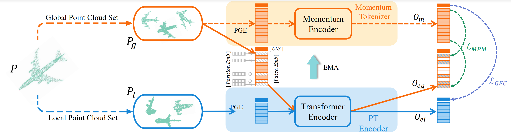

# POS-BERT: Point Cloud One-Stage BERT Pre-Training

PyTorch implementation and pretrained models for POS-BERT.

  

#
The code has been officially open source on CodeOcean. If you want to execute it online, you can directly check the following link [POS-BERT](https://codeocean.com/capsule/5546213/tree).
